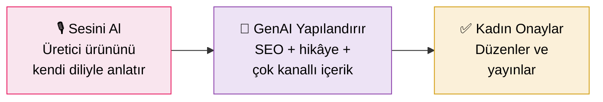

# 🌸 Üretken Kadın

### Şehirli üretici kadınlar için üretken yapay zekâ destekli pazarlama asistanı

*Emeği görünür kıl, hikâyeni sen anlat — gerisini yapay zekâ pazarlasın.*

 

---

## 💡 Proje Özeti

> Üretici kadının **kendi sesinden** anlattığı ürün hikâyesini; SEO uyumlu, çok kanallı ve
> **etik/şeffaf** bir dijital pazarlama kampanyasına çeviren bir yapay zekâ asistanı.
> Son karar her zaman üreticide kalır *(human-in-the-loop)*.

Türkiye'de binlerce kadın üretici kaliteli ürünler üretiyor ama pazarlama dilini (SEO, hikâye
anlatımı, sosyal medya) bilmedikleri için **dijitalde görünmez** kalıyor. Üretken Kadın tam da
bu **görünürlük boşluğunu** kapatır.

---

## ⚙️ Nasıl Çalışır?

---

## 🏷️ Adın Anlamı

| Sözcük | Neyi Çağrıştırır |
|:------:|------------------|
| **Kadın** | Hedef kitleyi doğrudan adlandırır → *algıda seçicilik* |
| **Üretken** | Hem üreticinin emeği/üretkenliği, hem de **üretken yapay zekâ (generative AI)** — bilinçli bir kelime oyunu |

---

## 🎯 Kime Hitap Ediyor?

- 🧵 Şehirde evinde **el emeğiyle** üreten (tekstil, el sanatı, gıda, tasarım) kadın girişimciler
- 📱 Ürünü kaliteli ama **dijital pazarlama kapasitesi** (SEO, hikâye, sosyal medya) düşük olanlar
- 💸 Profesyonel ajansa **bütçesi yetmeyen** mikro üreticiler

---

## ✨ Farkımız

| | Mevcut Platformlar | 🌸 Üretken Kadın |
|---|:---:|:---:|
| Pazara erişim (dükkan/ödeme) | ✅ | ➖ |
| **GenAI içerik üretimi** | ❌ | ✅ |
| Otantik sesi koruma | ❌ | ✅ |
| Etik & şeffaf (AI ifşası) | ❌ | ✅ |

---

## 📂 Depo İçeriği

| Dosya | İçerik |
|-------|--------|
| 📄 `Uretken_Kadin_AI_Marketing_Capstone.docx` | **Literatür Taraması · Veri Araştırması · Teknoloji İncelemesi** |

---

## 👩‍💻 Ekip

| İsim | GitHub |
|:------:|:------:|
| **Tuğçe Deniz** |  |
| **Barış Aslan** |  |

 

**Samsung Innovation Campus — AI in Marketing Capstone · Group 5**

*Emeğe ses, kadına görünürlük.* 🌸

