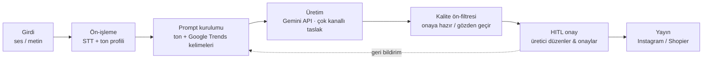

# 🧵 Üretken Kadın — Emeğin dijital sesi

**Şehirli üretici kadınlar için üretken yapay zekâ destekli pazarlama asistanı.**

Evinde el emeğiyle üretim yapan (tekstil, gıda, takı, tasarım) kadın girişimcilerin
ürünleri kalitelidir; ama dijital pazarlama dili (SEO, hikâye anlatımı, sosyal medya
tonu) çoğu zaman erişemedikleri bir beceridir. **Üretken Kadın**, üreticinin sesli
veya yazılı **doğal anlatımını** alır; Google Trends verisiyle harmanlayıp **SEO
uyumlu, çok kanallı pazarlama içeriğine** (Instagram gönderisi + Shopier açıklaması)
çevirir. Son karar **daima üreticidedir** (human-in-the-loop).

> Bu bir *AI in Marketing Capstone* projesidir.
> Ekip: **Tuğçe Deniz** · **Barış Aslan**

---

## ✨ Ne yapar?

| Özellik | Açıklama |
|---|---|
| ✍️ **İki kanallı içerik** | Tek anlatımdan Instagram gönderisi + Shopier ürün açıklaması (birbirinden farklı, her kanal kendi işine göre). |
| 🎙️ **Sesli anlatım** | Yazmak zor gelene: ses → metin (Gemini). Üreticinin kendi kelimeleri korunur, güzelleştirilmez. |
| 🔎 **Google Trends / SEO** | Anahtar kelimeler artık elle sabit değil; **canlı Google Trends** verisinden çekilir (ulaşılamazsa güvenli sabit listeye düşer). |
| 🤖 **İçerik kalite modeli** | Taslağın "onaya hazır" mı "revizyon gerek" mi olduğunu kestiren sınıflandırıcı — üreticinin inceleme yükünü azaltan **HITL ön-filtresi**. |
| 🎬 **Reels & fotoğraf** | Telefonla tek başına çekilebilecek Reels senaryosu ve ürüne özel fotoğraf rehberi. |
| 🟣 **Hikâye, WhatsApp, hashtag** | Aynı üründen 3 karelik Instagram hikâyesi, WhatsApp durum/müşteri mesajı ve gruplanmış hashtag seti. Hashtag'ler ayrıca kural tabanlı süzgeçten geçer: anlatımda olmayan malzeme ya da iddia (#doğalkumaş, #mucize…) çıkarılır. |
| 📅 **İçerik takvimi** | "Ne zaman paylaşacaksınız?" → seçilen günlere otomatik yerleşim; **telefon takvimine eklenen .ics** dosyası paylaşımdan 30 dk önce hatırlatır, metin hatırlatmanın içindedir. |
| 🏠 **Pano** | Hazır içerik, bu haftaki paylaşımlar, sıradaki paylaşım; "paylaştım" işareti, zamanı geçeni yarına alma. |
| 🔌 **İş ortakları için REST API** | Aynı çekirdek FastAPI ile dışarı açılır: içerik, formatlar, ses → metin, kalite, anahtar kelime, takvim. Anahtar başına günlük kota ve hız sınırı, `/docs` belgesi, Docker. Ayrıntı: **[API.md](API.md)** |
| 💾 **Kaydet / yükle** | Plan sunucuda saklanmaz (KVKK); kullanıcı dosyayı kendi cihazına kaydedip sonra geri yükler. |
| 🎨 **Ton profili** | Üretici kendi eski metinlerini yapıştırır; model onun üslubuyla yazar. |
| ⚖️ **Prompt karşılaştırma** | zero-shot / few-shot / chain-of-thought çıktıları yan yana (rapor kanıtı). |
| 📦 **Toplu üretim** | CSV yükle → tüm ürünler için tek seferde içerik. |
| 🛡️ **Etik & KVKK** | Abartı/uydurma yasağı prompt'ta gömülü; ses için **açık rıza** akışı ve aydınlatma. |

---

## 🏗️ Mimari


```mermaid
flowchart LR
    A[Girdi<br/>ses / metin] --> B[Ön-işleme<br/>STT + ton profili]
    B --> C[Prompt kurulumu<br/>ton + Google Trends kelimeleri]
    C --> D[Üretim<br/>Gemini API · çok kanallı taslak]
    D --> E[Kalite ön-filtresi<br/>onaya hazır / gözden geçir]
    E --> F[HITL onay<br/>üretici düzenler & onaylar]
    F --> G[Yayın<br/>Instagram / Shopier]
    F -.geri bildirim.-> C
```

**İnsan-döngüde (human-in-the-loop): son karar daima üreticide.**

---

## 🚀 Kurulum ve çalıştırma

Ayrıntılı, adım adım rehber için: **[KURULUM.md](KURULUM.md)**. Kısa özet:

```bash
# 1) sanal ortam
python -m venv .venv
source .venv/bin/activate          # Windows: .venv\Scripts\Activate.ps1

# 2) paketler
pip install -r requirements.txt

# 3) API anahtarı: .env.example -> .env kopyalayıp GEMINI_API_KEY yazın
#    (ücretsiz: https://aistudio.google.com)

# 4) arayüzü aç
streamlit run src/app.py
```

Anahtarsız da açılır; içerik üretmek için Gemini anahtarı gerekir (ücretsiz katman yeterli).

### İçerik kalite modelini eğitmek (opsiyonel)

```bash
python src/kalite_veri_uret.py     # prototip etiketli veri seti üretir
python src/kalite_egit.py          # modeli eğitir, metrik + grafik kaydeder
```

Model `models/kalite_modeli.joblib` altına kaydedilir; arayüz varsa otomatik kullanır,
yoksa özelliği sessizce gizler.

### Toplu test (capstone kanıtı)

```bash
python src/toplu_test.py           # 10 örnek, few_shot
python src/toplu_test.py --hepsi   # üç tekniği de çalıştır (karşılaştırma)
```

### Birim testleri (API anahtarı gerektirmez)

```bash
python tests/test_takvim.py        # planlama, .ics, kaydet/yükle doğrulaması
python tests/test_hashtag.py       # hashtag etik süzgeci
python tests/test_api.py           # REST API: kimlik, kota, hata kodları, KVKK
```

### REST API (iş ortakları)

```bash
pip install -r requirements-api.txt
python src/api_guvenlik.py yeni --ad "Kooperatif A" --kota 500   # anahtar oluştur
uvicorn api:app --app-dir src --reload                           # → http://127.0.0.1:8000/docs
```

Kimlik doğrulama, kota, hata kodları, KVKK ve Render / Cloud Run yayını: **[API.md](API.md)**

---

## 📁 Proje yapısı

```
Uretken_Kadin/
├── src/
│   ├── app.py               # Streamlit arayüzü (adım adım akış, pano, geliştirici modu)
│   ├── uret.py              # Çekirdek: Gemini üretimi, STT, ek formatlar, metrikler
│   ├── takvim.py            # İçerik takvimi: planlama, .ics, kaydet/yükle
│   ├── api.py               # İş ortakları için REST API (FastAPI)
│   ├── api_guvenlik.py      # API anahtarları, günlük kota, hız sınırı
│   ├── prompts.py           # Prompt şablonları + etik kısıtlar + ton profili
│   ├── trends.py            # Google Trends (pytrends) SEO kelime entegrasyonu
│   ├── kalite.py            # İçerik kalite modeli: öznitelikler + çıkarım
│   ├── kalite_veri_uret.py  # Kalite modeli için prototip etiketli veri üreteci
│   ├── kalite_egit.py       # Kalite modeli eğitimi (RF + GridSearchCV + eval)
│   ├── kvkk.py              # KVKK aydınlatma & açık rıza metinleri
│   └── toplu_test.py        # Toplu test + özet metrikler
├── data/
│   ├── ornekler.csv         # 10 örnek ürün anlatımı
│   ├── kalite_etiketli.csv  # (üretilir) kalite modeli veri seti
│   └── trends_onbellek.json # (üretilir) Trends önbelleği
├── models/                  # (üretilir) eğitilmiş kalite modeli
├── tests/                   # API gerektirmeyen birim testleri
├── ciktilar/                # toplu test + model çıktıları (kanıt)
├── requirements.txt         # Streamlit arayüzü
├── requirements-api.txt     # yalnızca REST API
├── Dockerfile               # API imajı (Render / Cloud Run)
├── API.md                   # iş ortağı rehberi + işletim
├── KURULUM.md               # ayrıntılı kurulum
├── ilerleme_baris.md        # Barış'ın eklediklerinin gelişim günlüğü
└── README.md
```

---

## 📊 Ölçülebilir kanıt (KPI)

- **İçerik üretimi:** few-shot toplu testte 10/10 başarı, **klişe: 0**, kanal
  benzerliği düşük (iki kanal gerçekten farklı).
- **Kalite modeli (prototip veri):** doğruluk ~%98, ROC-AUC yüksek; ayrıntılı
  metrik ve grafikler `ciktilar/model/` altında. *Not: prototip veri seti
  üzerindedir; saha pilotunda gerçek etiketlerle güncellenecektir.*

Metrik tanımları (görünürlük, otantiklik→dönüşüm, üretim hızı) için proje
dökümanlarındaki Concept Note'a bakınız.

---

## 🛡️ Etik & KVKK

- **Şeffaflık:** her içerikte YZ ile üretildiği belirtilir.
- **Otantiklik:** üreticinin somut kelimeleri korunur; hikâye uydurulmaz.
- **Abartısızlık:** "mucize / garanti / en iyi" gibi ispatsız iddialar, gıdada
  sağlık iddiası üretilmez (prompt'ta gömülü kural).
- **İnsan onayı:** hiçbir içerik üretici onayı olmadan kullanılmaz.
- **KVKK:** ses verisi için açık rıza + aydınlatma; veri minimizasyonu; anlatım
  kalıcı saklanmaz (bkz. `src/kvkk.py`).

---

## 🗺️ Yol haritası

- **Faz 1 (MVP, mevcut):** metin + SEO içerik üretimi, el sanatı/tekstil beachhead.
- **Faz 2:** görsel içerik üretimi ve ek kategoriler (gıda, tasarım).
- **Faz 3:** video içerik ve tüm ev-tabanlı mikro satıcılara genişleme.

---

*Üretken Kadın · Emeğin dijital sesi*
